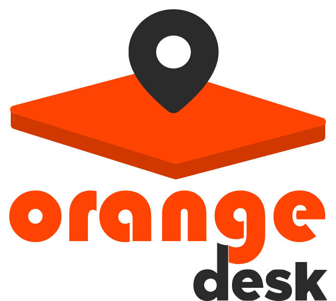
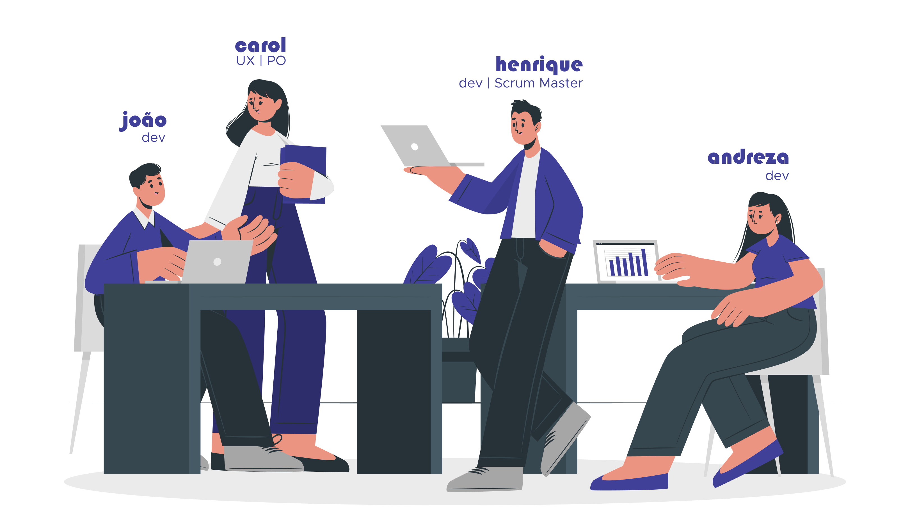

<h1 align='center'>Squad 16</h1>  

        

 

  <a href='#projeto'>Projeto</a> | 
  <a href='#tech'>Tecnologias</a> | 
  <a href='#layout'>Layout</a> | 
  

 

<h2 id='projeto'>:computer: Projeto:</h2>

  O projeto aqui apresentado foi desenvolvido durante o <a href='https://digital.fcamara.com.br/programadeformacao'><strong>Programa de Formação - Season 2</strong></a>, promovido pela <a href='https://www.fcamara.com.br'><strong>FCamara</strong></a>. Foi inédito participar do Hackathon, respirando tecnologia ao longo dessas duas semanas incríveis!

  Agora chegou a hora de colher os frutos do nosso trabalho. A seguir, apresentamos uma breve explicação sobre a problemática e a proposta que recebemos para trabalhar durante o Hackathon.  

<ul>
        <li><strong><em>Problemática:</em></strong> há quase dois anos os <strong>#SangueLaranjas</strong> estão trabalhando remotamente devido à pandemia da Covid-19. Com o avanço da vacinação, porém, a FCamara enxerga novas possibilidades. Todos estão ansisos pela reabertura dos escritórios, mas para isso acontencer de forma segura, os cuidados com higienização, uso de máscaras e limite de pessoas no mesmo ambiente continuarão a ser respeitados.</li>
        <li><strong><em>Proposta:</em></strong> para que a reabetura dos escritórios FCamara seja segura e organizada, precisamos criar uma aplicação web que permita aos <strong>#SangueLaranjas</strong> agendar a visita aos escritórios. Eles poderão preencher seus dados, escolher em qual unidade desejam trabalhar presencialmente e o dia.</li>
</ul>

 
<h3 align='center'>Acesse o projeto em produção para testar: <a href='https://orange-desk-front.herokuapp.com/'><strong>Orange Desk</strong></a></h3>
 

<h2 id='tech'>:rocket: Tecnologias:</h2>

        
        
        
        
        
        
        

 
<ul>
        <li><strong><em>Front End: </em></strong>além de utilizar as tecnologias básicas para o desenvolvimento web, decidimos utilizar alguns frameworks que padronizaram e agilizaram o desenvolvimento da aplicação. O Bootstrap foi aplicado para padronizar as classes em todas as páginas e facilitar o desenvolvimento do layout responsivo. O ReactJS permitiu componentizar partes do layout, permitindo a reusabilidade do mesmo trecho de código em várias páginas. Foram utilizadas algumas bibliotecas para React, como <a href='https://react-hook-form.com'>React Hook Form</a>, <a href='https://react-icons.github.io/react-icons/'>React Icons</a> e a <a href='https://kiarash-z.github.io/react-modern-calendar-datepicker/'>React Modern Calendar</a>. Para as requisições, optou-se pelo uso do <a href='https://axios-http.com'>Axios</a>.</li>
        <li><strong><em>Back End: </em></strong>para o desenvolvimento da API que realizaria a definição de rotas, processamento de requisições, validação de dados e comunicação com o Banco de Dados, foi utilizado o framework para NodeJS <a href='https://adonisjs.com'>AdonisJS</a>. Para armazenar os dados de acesso dos usuários, escritórios disponíveis para agendar a visita e os próprios agendamentos, optou-se pelo PostgreSQL.</li>
</ul>

<h2 id='layout'>:iphone: Layout:</h2>

Todo o layout da aplicação foi projetado em mobile-first, mas todas as páginas se ajustam a vários tamanhos de tela.
 

    As cores e fontes aplicadas também foram cuidadosamente selecionadas, obedecendo às diretrizes do estabelecidas no Brand Book FCamara. Para atender às necessidades dos usuários, o time UX-Design realizou entrevistas com vários <strong>#SangueLaranjas</strong>. Dessa forma foi possível definir as funcionalidades que seriam desenvolvidas e o fluxo de telas.

 
<h3 align='center'>Acesse o layout completo do projeto pelo Figma: <a href='https://www.figma.com/proto/I4aIiNDYrABpeEbjVpujbY/Untitled?node-id=701%3A18737&scaling=min-zoom&page-id=700%3A11868&starting-point-node-id=700%3A11869'><strong>Orange Desk - Protótipo final</strong></a></h3>
 

<h2 id='colab'>:man_technologist: Colaboradores:</h2>
 

        

 

<strong><em>Andreza Batista</em> - DEV:</strong>

<li><a href='https://github.com/AndrezaB97'>GitHub</a></li>
<li><a href='https://www.linkedin.com/in/andreza-batista-401183210/'>LinkedIn</a></li>
 

<strong><em>Henrique Rinaldi</em> - DEV:</strong>

<li><a href='https://github.com/RickQs'>GitHub</a></li>
<li><a href='https://www.linkedin.com/in/henrique-rinaldi'>LinkedIn</a></li>
 

<strong><em>João Victor P. Rodrigues</em> - DEV:</strong>

<li><a href='https://github.com/jvpr123'>GitHub</a></li>
<li><a href='https://www.linkedin.com/in/jo%C3%A3o-victor-pereira-rodrigues-6a65b8128/'>LinkedIn</a></li>
 

<strong><em>Caroline Barcella</em> - UX-Design:</strong>

<li><a href='https://www.linkedin.com/in/carolinebarcella/'>LinkedIn</a></li>
 
